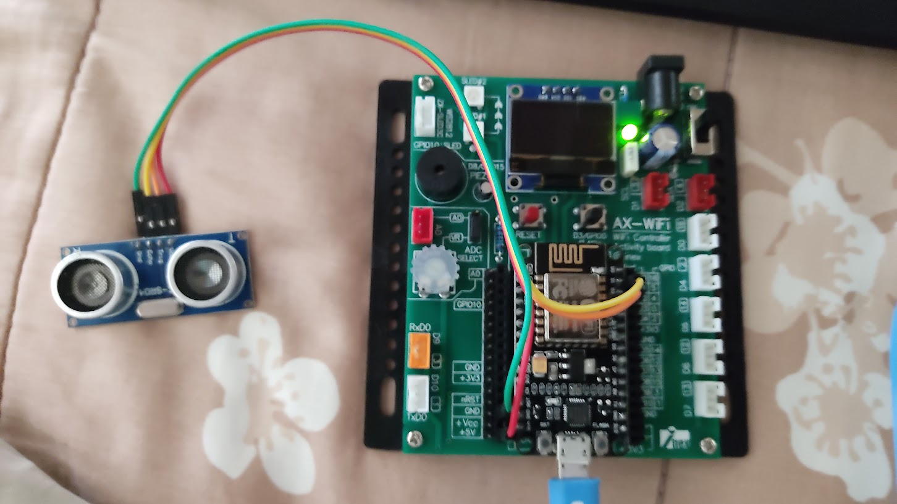

# Exercise 1: Ultrasonic Sensor & Buzzer

Exercise 1: Instructions
1. Create the circuit on the bread board in real
2. Create the Code so that the sound of the buzzer
will be changed depending on the distance.
• Use map function to change the distance into frequency
(far 200 Hz – close 1000 Hz).
3. Run the program and watch the behavior.
4. Take picture of circuit and submit it with code to
Gibbon.

# Circuit Image

##### I forgot to take a picture, so I recreated it with ESP8266. 

# [Jump to Code Section](./1.Ex1.Ultra_Buzzer.ino)
#### Buzzer and Ultrasonic class is add in same directory
