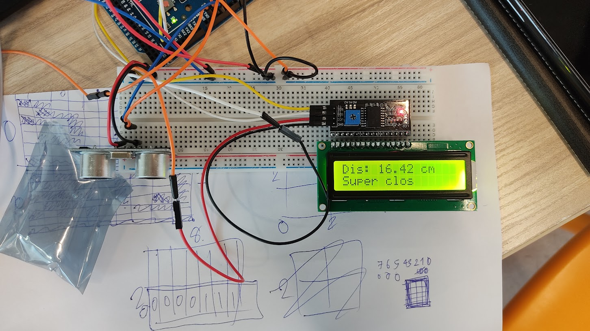

# Exercise 2: Ultrasonic Sensor & LCD Display

Create the circuit on the breadboard in real
• Suppose a car moves backwords, and needs to avoid collision.
• The LCD display in the car shows message to let you know there are some obstacles behind it.

Exercise 2: Instructions
1. Create the circuit on the bread board in real
2. Create the Code so that is works as below.
3. Run the program and watch the behavior.
• Use ruler to measure the distance in real.
4. Take picture of circuit and submit it with code to
Gibbon.

|State|Validation|LCD Display|
|:-:|:-:|:-:|
|No obstacles|distance > 200cm||
|Distant obstacle|200cm >= distance > 100cm|Far|
|Nearby obstacle|100cm >= distance > 50cm|Nearby|
|Super close obstacle|distance <= 50cm|Super close|

# Circuit Image

# [Jump to Code Section](./2.Ex2.Ultra_LCD.ino)
