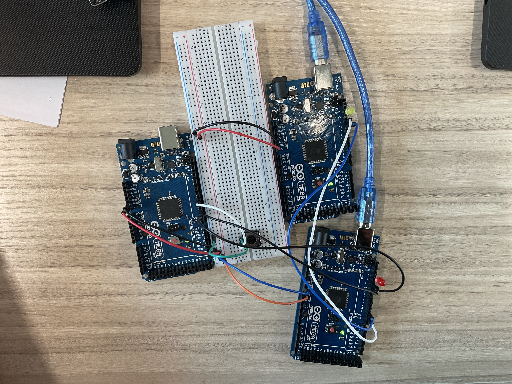

# Exercise 1: Software serial (1 Slave)

Create the Circuit and Code so that if push button of MasterMC is pressed the LED of SlaveMC turns on, but push button is released the LED turns off. (no need of PC’s input)

# Circuit Image

<!-- TODO: Add image -->

# Jump to Code Section

#### [master.ino](./master/master.ino)

#### [slave.ino](./slave/slave.ino)