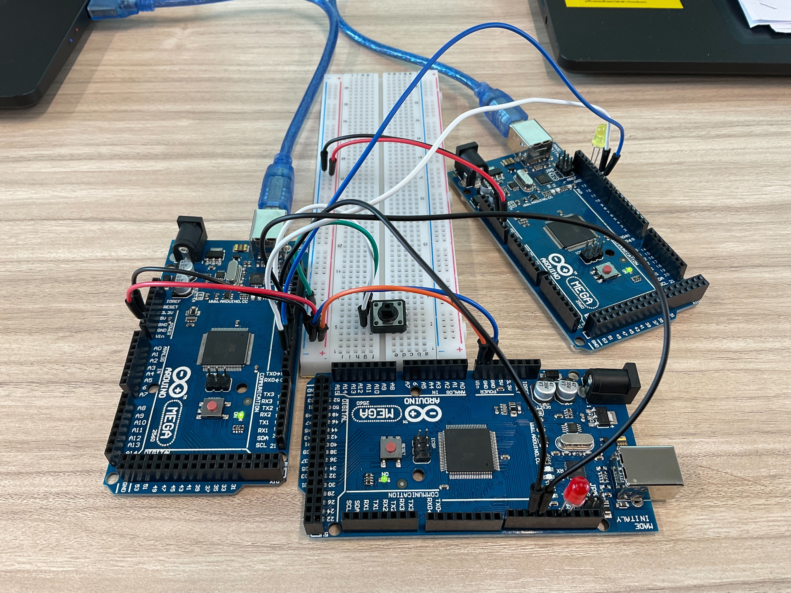

# Exercise 2: Software serial (2 Slave)

Connect the second slave Arduino called Slave2ndMC and LED (code is the same with the first one) to MasterMC, then change a code of the MasterMC to control 2 LEDs of 2 slave MCs turning on/off.

Use listen() in the loop() function in MasterMC and write it just before print(). 

# Circuit Image

<!-- TODO: Add image -->

# Jump to Code Section

#### [master.ino](./master/master.ino)

#### [slave1.ino](./slave1/slave1.ino)

#### [slave2.ino](./slave2/slave2.ino)