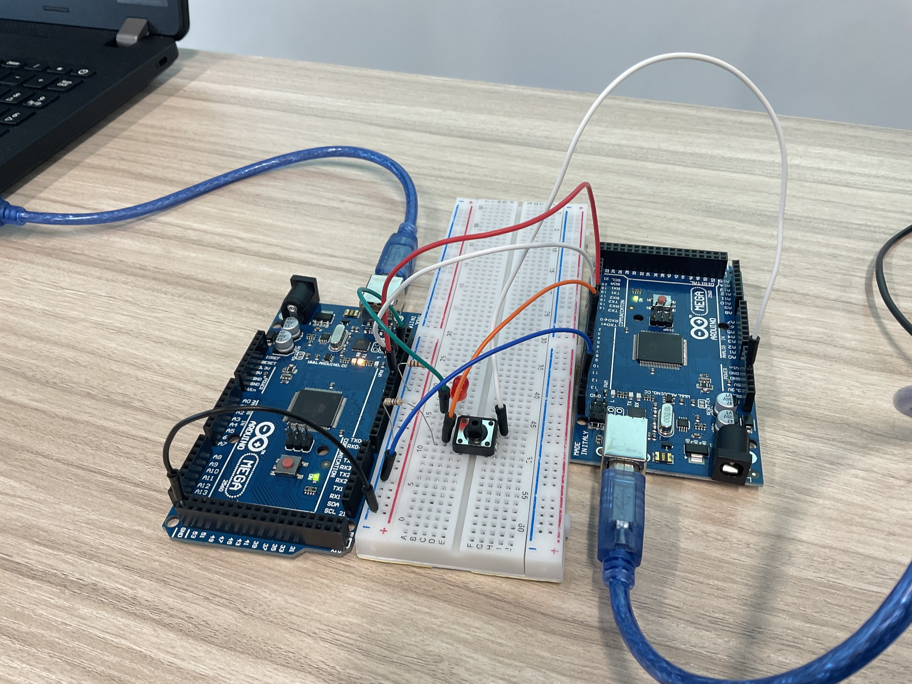

# Advanced Ex : Software serial (Relay-Slave)

Connect 3 Arduinos as cascading and create codes to make the second Arduino MasterMC and SlaveMC to relay data from the left Arduino to the right Arduino.

# Circuit Image

<!-- TODO: Add image -->

# Jump to Code Section

#### [master.ino](./master/master.ino)

#### [relay.ino](./relay/relay.ino)

#### [slave.ino](./slave/slave.ino)