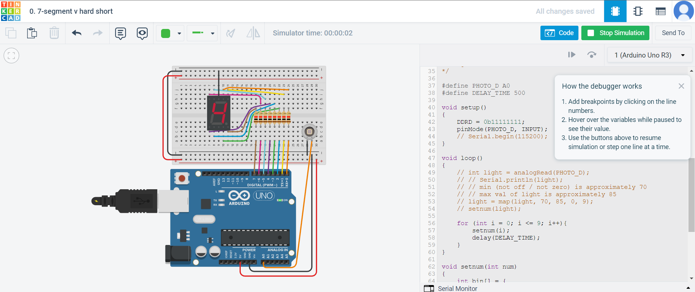

# Exercise 1: Make the circuit & code using 7-segment LED Display

## The short version, but harder ONLY FOR UNO BOARD or the board that compatible with Registor

# Circuit Image

# [Jump to Code Section](./code.ino)