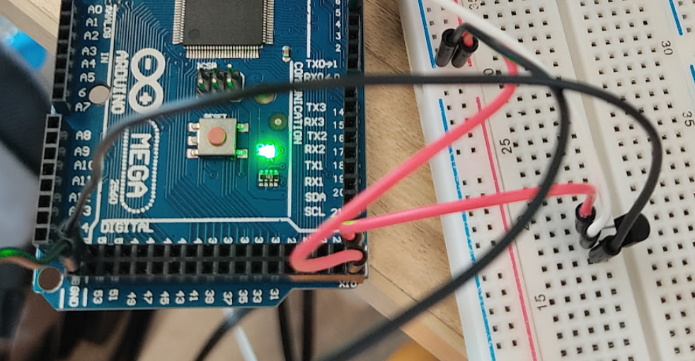

# Exercise 1: Temperature sensor (1)

## Instructions

1. Make the circuit of the figure on the bread board in
   real
2. Copy the code from Tinker CAD.
3. Run the code and watch the values on Serial Monitor.
4. Correct the equation (A) underlined.
5. Take a picture of the circuit and program, then submit
   them.

# Circuit Image

# [Jump to Code Section](./code.ino)
