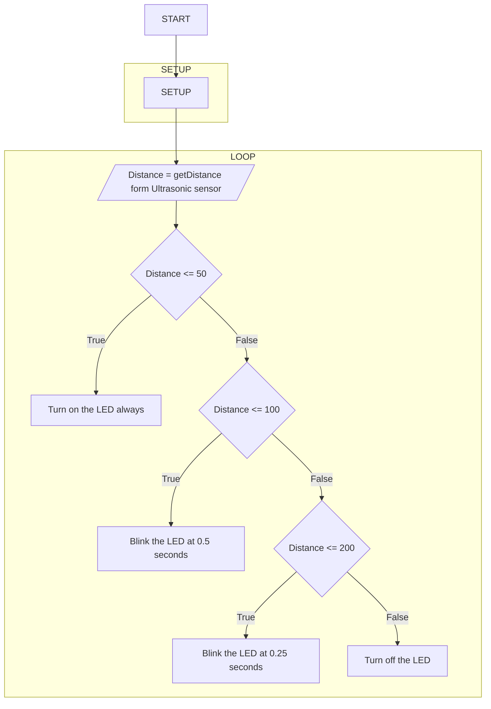
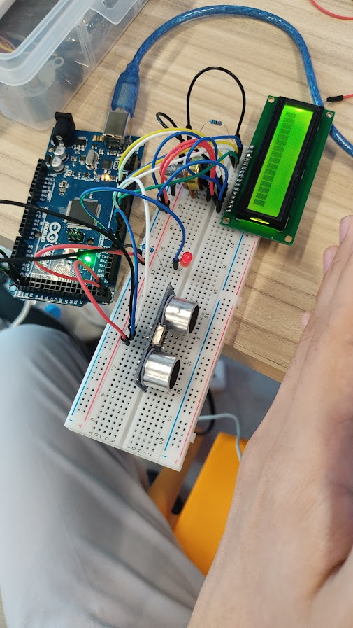

# Exercise 2: Ultrasonic sensor (2)

1. Create the circuit on the bread board in real
2. Draw the flowchart of the following table conditions
   and actions as follows. (only the table part is ok)

|        State         |        Validation         |               Description               |
| :------------------: | :-----------------------: | :-------------------------------------: |
|     No obstacles     |     distance > 200cm      |            Turn off the LED             |
|   Distant obstacle   | 200cm >= distance > 100cm | Blink the LED at 0.5 seconds intervals  |
|   Nearby obstacle    | 100cm >= distance > 50cm  | Blink the LED at 0.25 seconds intervals |
| Super close obstacle |     distance <= 50cm      |         Turn on the LED always          |

3. Create the Code so that is works as above.
4. Run the program and watch the behavior.
   • Use ruler to measure the distance in real.
5. Submit a flowchart, picture of the circuit, and code to
   report.

# Flowchart

# Circuit Image

# [Jump to Code Section](./sketch.ino)
