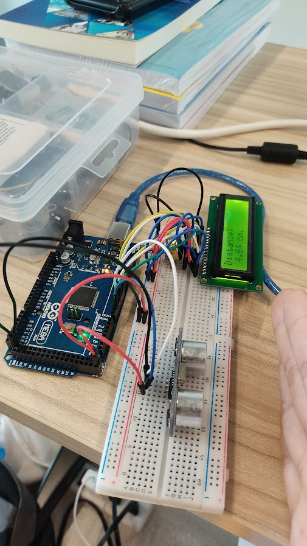

# Exercise 3: LCD Instructions

1. Create the circuit like the figure from the Exercise 2
on the bread board in real
2. Refer the last lesson’s code so that LCD displays the
distance as below.
3. Run the code and change the distance of the obstacle.
4. Check the values if the distance shown on the LCD
and the circuit are the same or not. Use a ruler.
5. Submit a picture of the circuit and code to report

# Circuit Image

# [Jump to Code Section](./sketch.ino)
