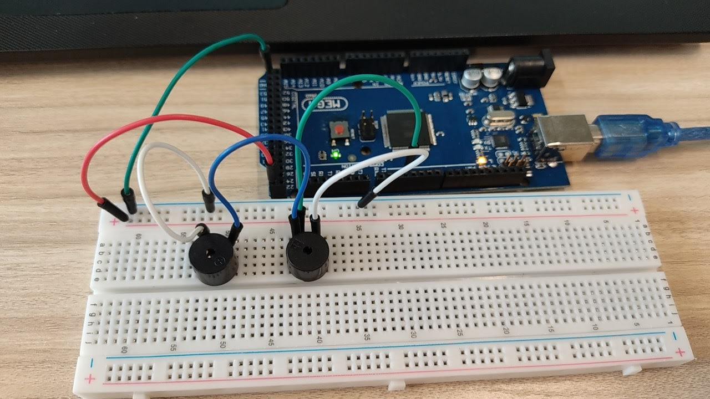

# Exercise 1: Play music using PWM tone function 

1. Create the circuit as shown in the figure.
2. Create the code which plays “Happy Birthday”
using tone function which explained in the next
slide.
```Arduino
#define DO 261
#define RE 293
```
3. Refer the note and frequency table in the next
slide.

# Circuit Image



# [Jump to Code Section](./1.Exercise1_Buzzer_HBD.ino)
