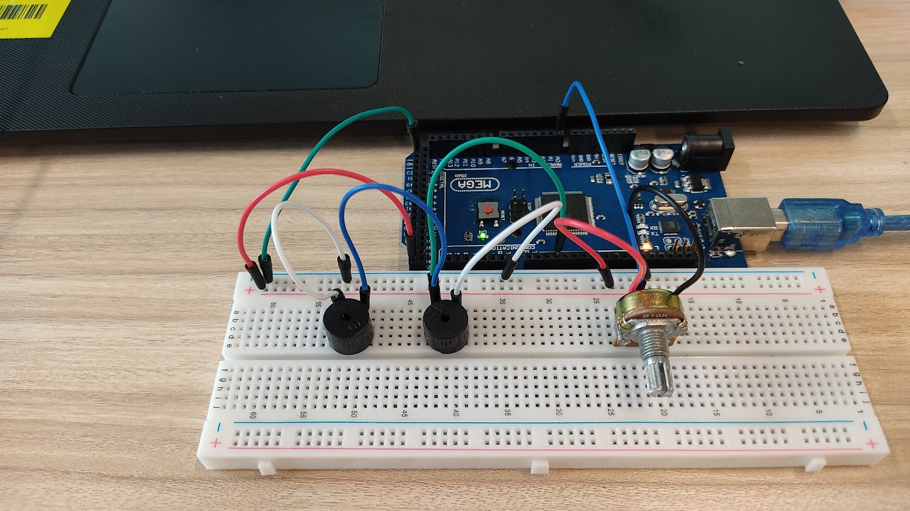

# Exercise 2: Change frequency by potentiometer 

1. Create the code to play buzzer so that its frequency
can be changed by potentiometer.
2. Use map function to change the frequency.
```Arduino
val = analogRead(POT_PIN);
frequency = map(val, 0, 1023, 20, 20000);
tone(BUZZER_PIN, frequency, 100); untone(100);
```

# Circuit Image



# [Jump to Code Section](./code.ino)
