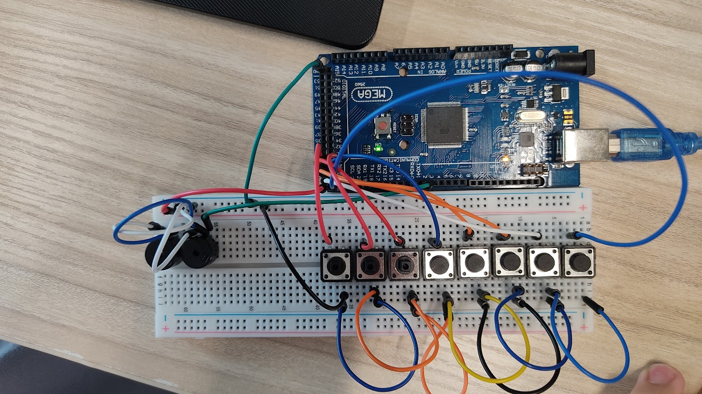

# Exercise 3: Create a Digital Piano using push buttons
1. Create the circuit with at least 7 buttons which
represent Piano keys of Do, Re, Mi, Fa, So, Ra, Si.
(Next octave Do is also OK)
No resistance required.
2. Create the code to play each tone by pushing
button.
```Arduino
#define DO 261
pinMode(DO, INPUT_PULLUP);
```
3. Frequency of each tone is shown


# Circuit Image



# [Jump to Code Section](./3.Exercise3_Digital_Piano_using_buttons.ino)
